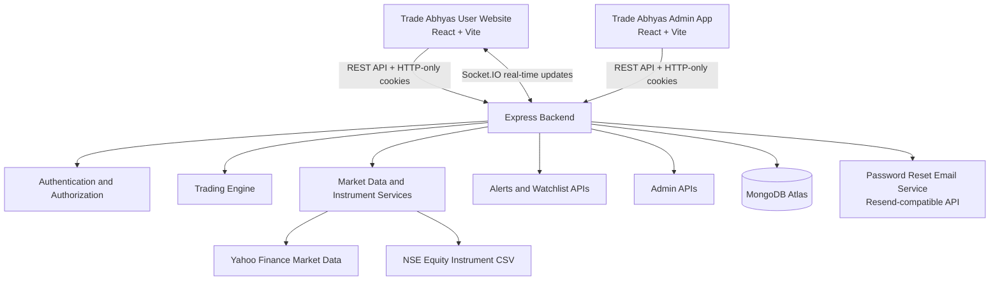

# System Architecture

## Architecture Summary

Trade Abhyas uses a MERN-style architecture with two separate React applications and one Express backend.

- The **User Website** provides trading, portfolio, watchlist, alerts, positions, orders, and account settings.
- The **Admin Application** provides role-protected operational monitoring.
- The **Backend** provides REST APIs, Socket.IO real-time channels, authentication, trading logic, and MongoDB persistence.
- **MongoDB Atlas** stores users, orders, transactions, holdings, alerts, watchlists, instruments, competitions, and refresh tokens.

## Architecture Diagram

## Backend Layers

| Layer | Responsibility |
| --- | --- |
| Routes | Define API endpoints and attach authentication/validation middleware. |
| Controllers | Handle request/response logic. |
| Services | Implement trading, market session, instrument, live market, and email logic. |
| Models | Define Mongoose schemas and indexes. |
| Scripts | Provide audit, reconciliation, and instrument sync tasks. |

## Real-Time Channel

Socket.IO is used for:

- Authenticated socket connections.
- Symbol subscriptions.
- Quote updates.
- Order, portfolio, position, transaction, analytics, alert, and leaderboard events.

## Deployment-Oriented Configuration

The backend validates production environment variables such as `MONGO_URI`, `JWT_SECRET`, `CLIENT_URL`, `ADMIN_URL`, cookie configuration, and email configuration. Actual production deployment and real email provider credentials are intentionally separate deployment steps.

## Screenshot Evidence

Architecture-related interface evidence:

- `docs/screenshots/03-dashboard.png` - User website connected to backend account data.
- `docs/screenshots/05-stock-detail.png` - Market-data and trading interface.
- `docs/screenshots/18-admin-dashboard.png` - Separate admin application connected to the same backend.
