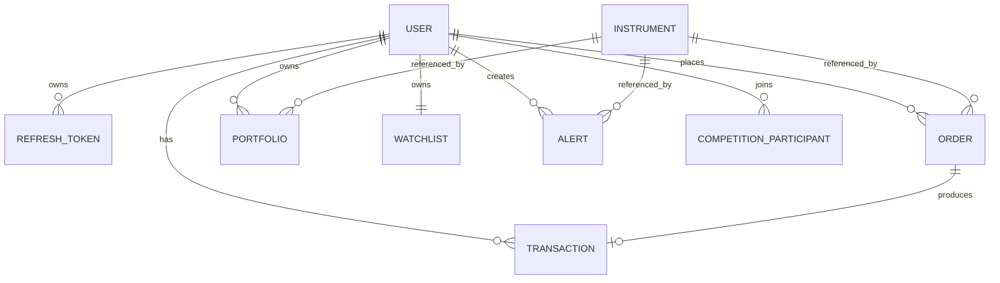

# Database Design

## Database

Trade Abhyas uses MongoDB with Mongoose models. The database stores only application data required for a virtual trading platform. It does not store bank account details, PAN card numbers, demat account numbers, brokerage credentials, or real-money settlement data.

## Collections

| Collection | Purpose |
| --- | --- |
| users | Stores account identity, authentication fields, virtual balance, role, and allowed profile preferences. |
| refreshtokens | Stores hashed refresh tokens for persistent sessions and logout/revocation. |
| instruments | Stores active NSE equity instrument metadata used for search and validation. |
| orders | Stores submitted virtual orders and their lifecycle status. |
| transactions | Stores executed virtual trades produced from orders. |
| portfolios | Stores current active holdings per user and symbol. |
| watchlists | Stores each user's saved instruments and watchlist lists. |
| alerts | Stores user-created price alerts. |
| competitions | Stores simulated competitions and participant virtual balances. |

## Entity Relationship Diagram

## Important Fields

| Model | Important Fields |
| --- | --- |
| User | name, email, password hash, avatar, phone, trading preferences, notification preferences, virtual balance, role, token version, login lock fields, password reset fields. |
| RefreshToken | user reference, token hash, expiry date, replacement hash, revoked flag, revocation time. |
| Instrument | symbol, trading symbol, company name, exchange, series, ISIN, instrument type, active flag, search text, sync timestamp. |
| Order | user reference, symbol, company name, side, quantity, order type, trigger price, limit price, status, execution price, executed quantity, timestamps, rejection/cancellation reason, processing token. |
| Transaction | user reference, order reference, type, symbol, company name, quantity, price, total, realized P&L, timestamp. |
| Portfolio | user reference, symbol, company name, quantity, average buy price, total invested. |
| Watchlist | user reference, active list, symbols, named lists, list items. |
| Alert | user reference, symbol, target price, above/below condition, triggered status, trigger timestamp, trigger price. |
| Competition | name, description, start/end dates, starting balance, participants, status, archived flag. |

## Indexes and Integrity Rules

| Area | Rule |
| --- | --- |
| Users | Email is unique to prevent duplicate accounts. |
| Refresh tokens | Token hash is unique; user and expiry indexes support session lookup and cleanup. |
| Instruments | Exchange plus trading symbol is unique; search indexes support stock discovery. |
| Orders | User/time, symbol/status, and processing-token indexes support history and execution checks. |
| Transactions | Order reference is unique for executed orders, preventing duplicate transaction creation. |
| Portfolio | User plus symbol is unique, so each user has one holding row per symbol. |
| Watchlist | User reference is unique, giving each user one watchlist document. |

## Data Accuracy Notes

Trading data is updated through the backend trading engine rather than direct frontend mutation. Balance, portfolio, orders, and transactions are changed together during order execution to avoid mismatched account states.

