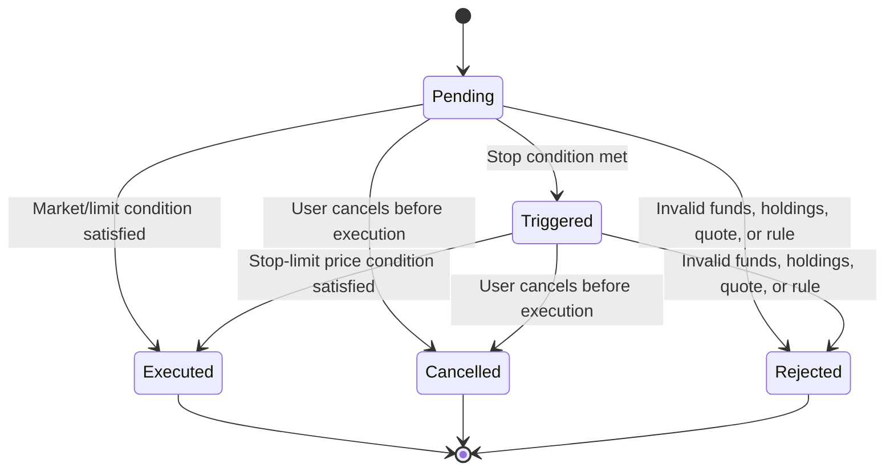

# Trading Engine Design

## Purpose

The trading engine is the most important backend component in Trade Abhyas. It simulates stock order execution using virtual balances and holdings. It is designed to behave like a learning-focused trading platform without connecting to a broker or stock exchange execution system.

## Supported Order Types

| Order Type | Behavior |
| --- | --- |
| MARKET | Executes immediately when the market is open and a valid executable quote is available. |
| LIMIT | Executes only when the market price satisfies the user's limit price. |
| STOP_LOSS | Remains pending until the trigger price is reached, then executes as a market-style paper order. |
| STOP_LIMIT | Remains pending until the trigger price is reached, then executes only if the limit condition is also satisfied. |

## Supported Sides

| Side | Meaning |
| --- | --- |
| BUY | Uses virtual cash to create or increase a holding. |
| SELL | Reduces or closes an existing holding and credits virtual cash. |

## Order Lifecycle



## Market Session Rules

The market-session service uses India time. Orders execute only during the configured NSE-style weekday session from 09:15 to 15:30, excluding configured holidays. Closed-market orders remain pending instead of being executed immediately.

## Quote Validation

An order is executable only when the quote is valid. The backend rejects or skips execution when a quote is missing, non-positive, unavailable, stale, mismatched to the requested symbol, suspended/halted, or outside circuit-style bounds.

## BUY Execution

For a valid BUY:

- The engine verifies that the user has enough virtual cash.
- The user's virtual balance is debited.
- The portfolio holding is created or updated.
- The weighted average buy price is recalculated.
- A transaction is created.
- Order status becomes `Executed`.

Weighted average formula:

```text
newAveragePrice = (oldTotalInvested + newBuyTotal) / newQuantity
```

## SELL Execution

For a valid SELL:

- The engine verifies that the user owns enough quantity.
- The user's virtual balance is credited.
- The portfolio quantity is reduced for a partial sell.
- The holding is removed when the full quantity is sold.
- Realized P&L is calculated.
- A transaction is created.
- Order status becomes `Executed`.

Realized P&L formula:

```text
realizedPnL = (sellPrice - averageBuyPrice) * soldQuantity
```

## Portfolio Accounting

Portfolio accounting is updated only after an order executes.

BUY balance change:

```text
newBalance = oldBalance - (executionPrice * quantity)
```

SELL balance change:

```text
newBalance = oldBalance + (executionPrice * quantity)
```

Weighted average buy price:

```text
newAveragePrice =
(oldQuantity * oldAveragePrice + buyQuantity * buyPrice)
/
(oldQuantity + buyQuantity)
```

Unrealized P&L:

```text
unrealizedPnL = (currentPrice - averageBuyPrice) * currentQuantity
```

Partial sells reduce quantity but keep the existing average buy price for the remaining holding. A full sell closes the holding row.

## Concurrency Protection

The order engine uses MongoDB sessions/transactions, processing tokens, retry logic, and conditional updates. This protects against duplicate execution, overselling, negative balances, duplicate transactions, and stale order-claim failures during concurrent processing.

## Integrity Guarantees

The implementation is designed around these rules:

- An executed order should have exactly one transaction.
- A cancelled or rejected order should not mutate portfolio or balance.
- A user balance should not become negative after a BUY.
- A user holding should not become negative after a SELL.
- Portfolio rows should not be duplicated for the same user and symbol.
- Real trading, exchange execution, bank settlement, and PAN/brokerage verification are outside scope.
